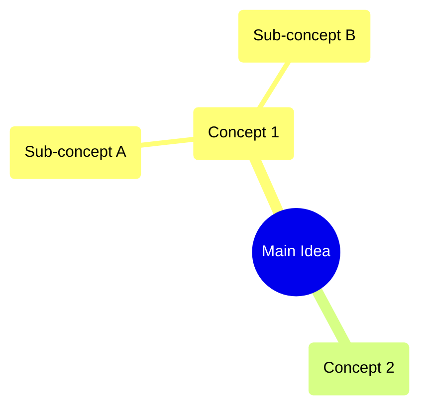

# Sample File 2

Another markdown file with different content.

## Features
- Mind map test
- AI summarization
- Mermaid diagram:

```mermaid
mindmap
  root((Main Idea))
    (Concept 1)
      (Sub-concept A)
      (Sub-concept B)
    (Concept 2)
```

## Related
See [Sample 1](./sample1.md) for more info.
